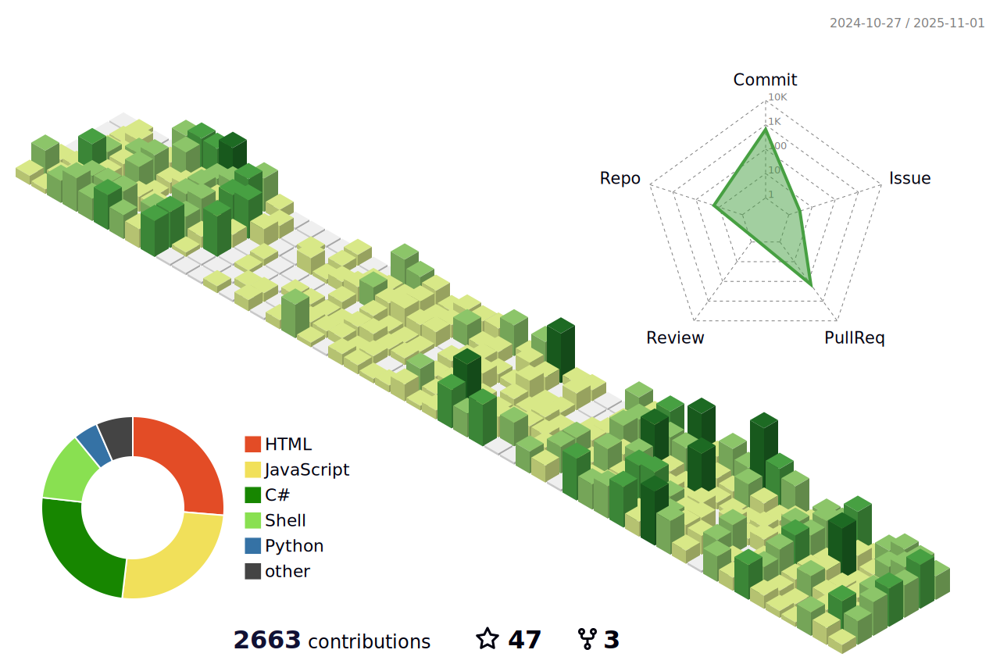

# LoveDoLove

<!--  -->

---

## 👋 About Me

**Innovative Full-Stack Developer & DevOps Engineer** specializing in enterprise-level web applications, cross-platform automation, and scalable cloud infrastructure. Expert in building production-ready systems from concept to deployment.

- 🔭 I’m currently working on: **Hotel Management System, FreeBSD Cross-Compilation Suite, EasyKit - Windows Automation**
- 🌱 I’m learning: **AI & Machine Learning, Cloud Native DevOps**
- 💬 Ask me about: **Full-Stack, DevOps, System Architecture, Automation**
- 📫 How to reach me: [contact@lovedolove.dev](mailto:contact@lovedolove.dev)
- 🌐 Portfolio: [LoveDoLove Portfolio](https://github.com/LoveDoLove)

---

## 🚀 Key Skills & Technology Stack

- **Top Mastery:** C#, .NET Core/ASP.NET Core, Windows, GitHub Actions, Cloudflare, Nginx, Markdown, CI/CD, Firebase, Azure, AWS
- **Intermediate:** PHP, Python, HTML, CSS, Tailwind, Bootstrap, Laravel, Flask, MySQL, SQL Server, Open Source, JavaScript, Node.js, Express, Vue.js, Selenium
- **Exploratory/Support:** FreeBSD, Bash, Raspberry Pi, OpenCV, Postman, Git, VS Code, Visual Studio, Apache, Jupyter Notebook, Matplotlib, NumPy, Pandas, C

---

## 🌟 Featured Projects

### [Hotel Management System](https://hotel.lovedolove.nyc.mn/)

Enterprise-grade hotel reservation platform with user registration, room booking, payment processing, admin dashboard, and comprehensive reporting features.

- **Tech:** C#, .NET Core, Entity Framework, SQL Server, Bootstrap
- **Status:** Production

### FreeBSD Cross-Compilation Suite

Automated CI/CD pipelines for building popular applications (Alist, Memos, Cloudreve) for FreeBSD, featuring GitHub Actions and cross-platform toolchains.

- **Tech:** Shell, GitHub Actions, FreeBSD, Go, Docker
- **Status:** Open Source

### EasyKit - Windows Automation

Comprehensive Windows toolkit for automating common tasks, system maintenance, and productivity enhancement with intuitive GUI and batch processing.

- **Tech:** C#, WinForms, PowerShell, Windows API, Automation
- **Status:** Active

### Face Recognition Attendance System

AI-powered attendance tracking system using facial recognition technology with real-time processing, database integration, and administrative controls.

- **Tech:** PHP, Python, OpenCV, MySQL, Machine Learning
- **Status:** Live

### CS Common Utilities Library

Production-ready C#/.NET utility library featuring captcha generation, QR codes, email services, image processing, Stripe integration, and security tools.

- **Tech:** C#, .NET 8, NuGet, Stripe API, Image Processing
- **Status:** Package

### Laravel Setup Kit

Comprehensive Laravel starter template with Firebase integration, Spatie permissions, Stripe payments, SweetAlert2, and modern UI components.

- **Tech:** Laravel, PHP, Firebase, Stripe, Tailwind CSS
- **Status:** Template

---

## 🏆 Development Highlights

- **Academic Excellence:**

  - Developed 15+ comprehensive academic projects including AI chatbots, face recognition systems, and e-commerce platforms
  - Expertise in computer systems architecture, data structures & algorithms, and system design
  - Multiple programming languages: Assembly, Java, C#, PHP, Python, HTML/CSS/JS

- **Open Source Contributions:**
  - Created specialized FreeBSD build automation for popular open-source projects
  - Published reusable CI/CD templates and GitHub Actions workflows
  - Developed cross-platform utilities and starter kits for rapid development

---

## 📫 Contact

- [GitHub Portfolio](https://github.com/LoveDoLove)
- [Academic Projects](https://github.com/LoveDoLove-School-Projects)
- [Email](mailto:contact@lovedolove.dev)

---

> _Looking for a developer who can handle everything from frontend UX to backend architecture, DevOps automation, and system deployment? Let's discuss your next project!_
